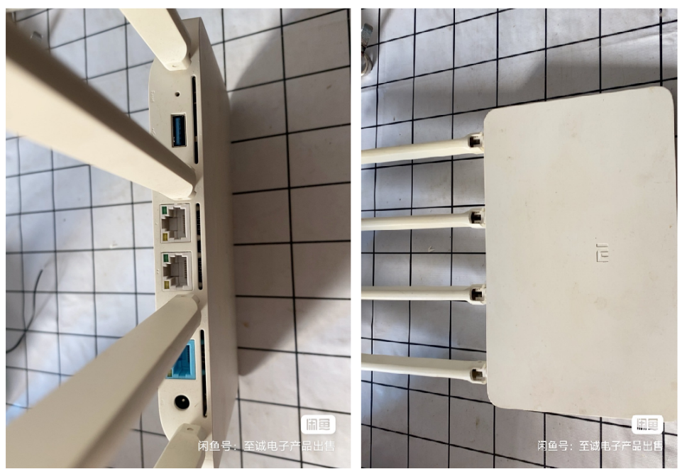

# Njupt-Wifi-Login

路由器自动连接南京邮电大学（仙林）校园网教程，使用shell脚本

Router automatically connects to the campus network of Nanjing University of Posts and Telecommunications

## 1.声明

该教程只用于学习交流，请勿他用

感谢`21级人工智能大佬`提供的校园网登录`shell`脚本，其帮助我配置好了路由器环境并正常工作。

本教程基于大佬的配置操作进行复盘，开源给各位校友使用，小白也能看懂！

> 部分操作参考视频 [小米路由器3G刷机评测](https://www.bilibili.com/video/BV1R84y1z7bi/?spm_id_from=333.1007.top_right_bar_window_default_collection.content.click)

----

## 2.准备工作

需要的工具如下：

* 带RJ45网线接口的电脑
* RJ45网线一根
* U盘（容量大于2G）
* 牙签（用来按路由器的`reset`按钮）

路由器选择：

* 推荐：小米3G千兆路由器（咸鱼55左右入手，性价比极高）
* 任何可以利用breed刷机，装openwrt或hiboy固件的路由器（参考网上的教程）
* 树莓派等带wifi功能的开发板（不推荐，树莓派的wifi稳定性很差；更别提树莓派现在的价格够你买8个小米3G）
* 旧电脑装linux挂脚本+开热点（有亿点点贵）

除此之外，你还可以给自己的电脑装linux当**主力系统**，脚本挂后台`开机自启/定时任务`

说明：

* 笔记本电脑需要带网线接口，否则无法进入路由器`breed`后台。如果你的笔记本不带网线接口，可以借用舍友的电脑操作（只有一个步骤需要）若实在找不到带网口的电脑，则需要购买`TypeC-RJ45`的转接头
* 小米路由器3G一定要买带**USB接口**的版本，否则无法刷机（如下图，背后需要带usb接口）

## 3.一切就绪，开整！

如果你准备好了上述设备，请转到 [data/教程](./data) 查看详细操作

## issue/pull request

如在配置过程中遇到了什么问题，可开放issue提出

欢迎`pull request`丰富本教程！

## 求star✨

如果本教程帮到了你，还请点个`star`让更多校友看到本仓库！

