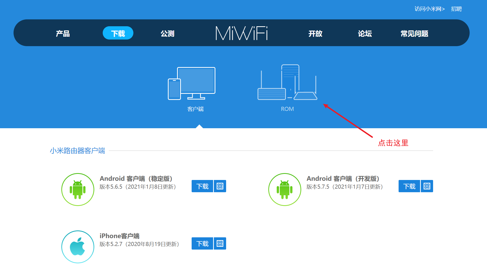
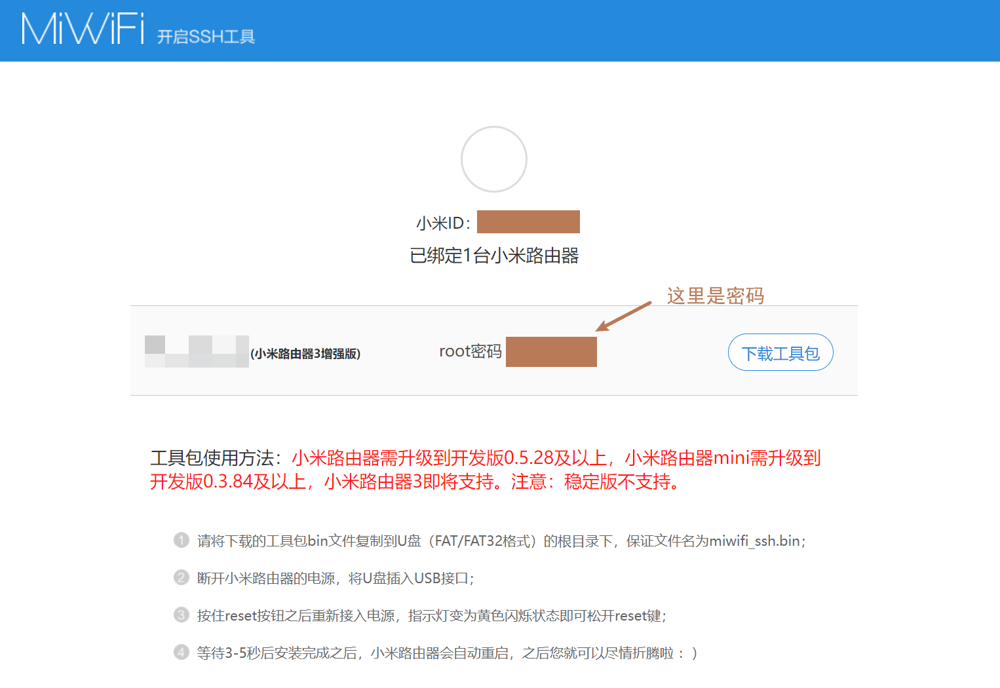

# 小米路由器3G刷机教程

> 注：本教程不一定适用于其他小米路由器

仓库内提供的文件仅供备用，建议跟随教程到指定网址下载最新版本文件进行操作

-----

## 0.到货后验收

咸鱼购买了小米路由器3G后，请先通电，用牙签顶住路由器USB接口旁边的reset孔位，直到路由器黄灯闪烁，重置为出厂设置（路由器背面有教程）

若买来的二手路由器自带密码，此方法重置后将不带密码

连接路由器后，进入管理后台`192.168.31.1`或者手机下载app`小米WIFI`，绑定小米账户并初始化路由器。此时可以用网线将路由器接入学校网络，会弹出和直接连接校园网wifi一样的登陆页面。登录后测试路由器能否正常上网，以及信号有无问题

## 1.刷入开发者固件

进入官网，下载小米路由器3G开发者固件

>http://www1.miwifi.com/miwifi_download.html

对应文件为`/data/miwifi_r3g_firmware_12f97_2.25.124.bin`

刷入固件的方法有两种，建议用方法一：

* 方法一：电脑登录小米路由器后台，点击`常用设置-系统状态-系统版本-手动升级`，选择你刚刚下载的开发者固件，等待它自己刷好（变蓝）即可
* 方法二：将该文件重命名为`miwifi.bin`放入U盘（U盘需格式化为`FAT32`格式，建议清空U盘后操作）路由器断电，插入U盘，用牙签顶住reset，通电，待指示灯变黄之后松开，等待它变蓝

刷入开发者固件成功后，连接看看路由器能否正常上网

## 2.开启路由器ssh

打开小米路由器ssh官网，用路由器绑定的小米账户登录

>https://d.miwifi.com/rom/ssh

必须要是绑定了这个路由器的小米账户哦！

如果绑定成功的话，下面会出现小米路由器3G，并显示root密码，记录下这个密码，后面要用到。

点击下载工具包，工具包文件名为：`miwifi_ssh.bin`

> 因为不同机器的工具包可能不一样，出于安全性考虑，本仓库内并没有备用文件

参考官方的教程，将工具包刷入路由器

-----

## 3.ssh连接路由器

路由器重启之后

