# 小米路由器3G刷机教程

> 注：本教程不一定适用于其他小米路由器，但大致操作类似

仓库内提供的文件仅供备用，建议跟随教程到指定网址下载最新版本文件进行操作

-----

## 0.到货后验收

咸鱼购买了小米路由器3G后，请先通电，用牙签顶住路由器USB接口旁边的reset孔位，直到路由器黄灯闪烁，重置为出厂设置（路由器背面有教程）

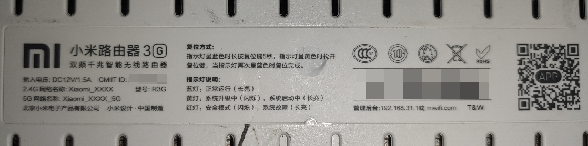

若买来的二手路由器自带密码，此方法重置后将不带密码

连接路由器后，进入管理后台`192.168.31.1`或者手机下载app`小米WIFI`，绑定小米账户并初始化路由器。此时可以用网线将路由器接入学校网络，会弹出和直接连接校园网wifi一样的登陆页面。登录后测试路由器能否正常上网，以及信号有无问题

## 1.刷入开发者固件

进入官网，下载小米路由器3G开发者固件

>http://www1.miwifi.com/miwifi_download.html

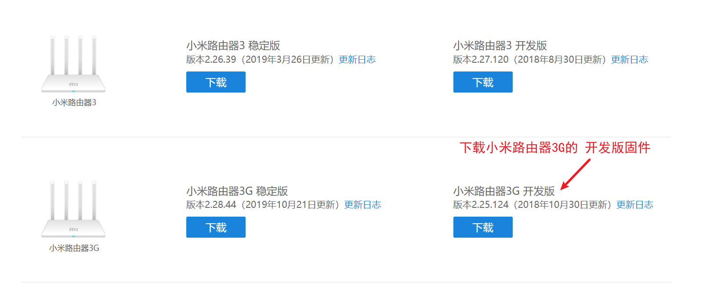

对应文件为 [/data/miwifi_r3g_firmware_12f97_2.25.124.bin](./miwifi_r3g_firmware_12f97_2.25.124.bin)

刷入固件的方法有两种，建议用方法一：

* 方法一：电脑登录小米路由器后台，点击`常用设置-系统状态-系统版本-手动升级`，选择你刚刚下载的开发者固件，等待它自己刷好（变蓝）即可
* 方法二：将该文件重命名为`miwifi.bin`放入U盘（U盘需格式化为`FAT32`格式，建议清空U盘后操作）路由器断电，插入U盘，用牙签顶住reset，通电，待指示灯变黄之后松开，等待它变蓝

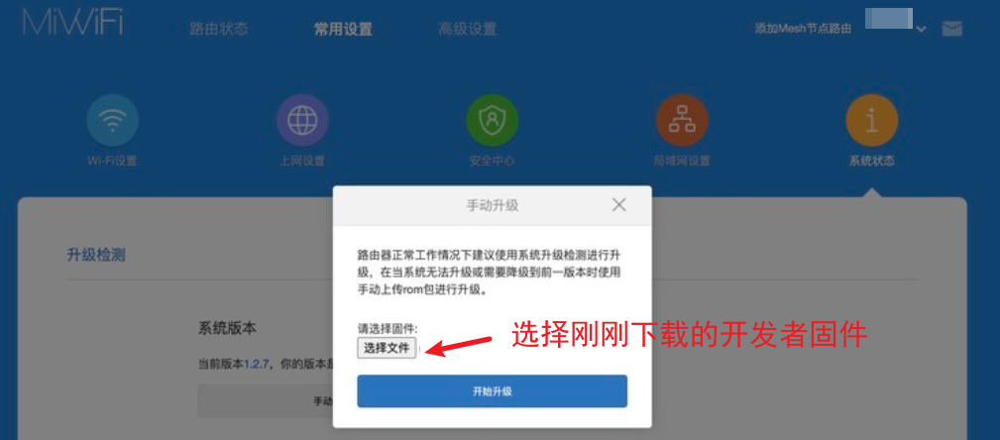

刷入开发者固件成功后，连接看看路由器能否正常上网

## 2.开启路由器ssh

打开小米路由器ssh官网，用路由器绑定的小米账户登录

>https://d.miwifi.com/rom/ssh

必须要是绑定了这个路由器的小米账户哦！

如果绑定成功的话，下面会出现小米路由器3G，并显示root密码，记录下这个密码，后面要用到。

点击下载工具包，工具包文件名为：`miwifi_ssh.bin`

> 因为不同机器的工具包可能不一样，出于安全性考虑，本仓库内并没有备用文件

参考官方的教程，将工具包刷入路由器

-----

## 3.ssh连接路由器

路由器重启之后，便可以通过ssh连接到路由器了

这里需要下载`Xshell`或者`putty`。推荐大家下载Xshell，免费而且使用比较方便

> https://www.xshell.com/zh/free-for-home-school/

输入你的名字和邮箱，勾选两者（Xshell和Xftp都有用哦）

官方会给你的邮箱发一个下载连接

下载软件后安装，打开Xshell，在本地Shell页面输入下面的命令连接路由器

~~~
ssh root@192.168.31.1:22
~~~

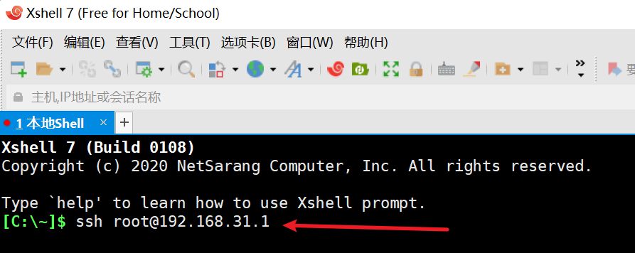

在弹出来的页面里面输入用户名`root`，密码为刚刚小米官网给你提供的密码

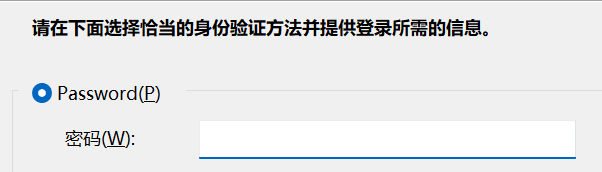

随后咱们就连上了！

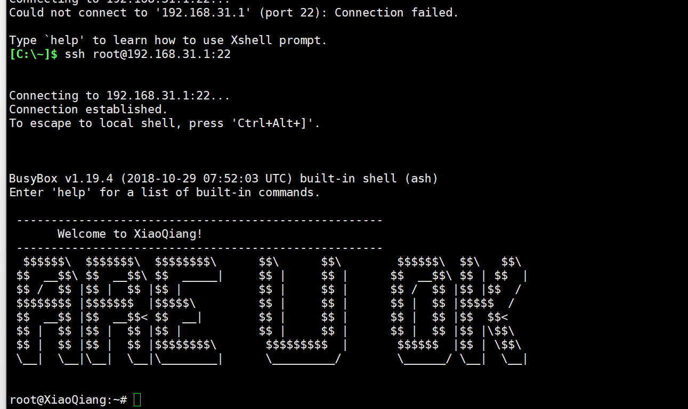

看到这个界面，请自动在脑海里播放`Are you ok? hello, thank you...`

停，打住，我们不是来干这个的

-----

## 4.scp传bread到路由器

进入breed网站，下载红米3G对应的breed

>https://breed.hackpascal.net/

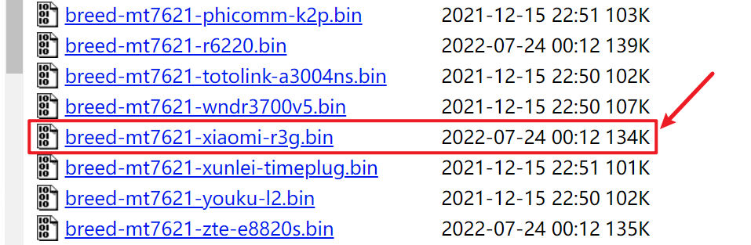

文件对应本仓库中的 [/data/breed-mt7621-xiaomi-r3g.bin](./breed-mt7621-xiaomi-r3g.bin)，因为不同版本的breed界面不一样，可以下载仓库里面的这个进行操作

下载完成之后，将文件拷贝到C盘。`WIN+R`输入`cmd`打开命令提示符，使用`scp`命令将文件发送到路由器的`/tmp`目录中

> 这里不能使用`Xftp`，因为小米的这个路由器是`read only file system`，`Xftp`传不进去东西的，会报错

~~~
scp c:\breed-mt7621-xiaomi-r3g.bin root@192.168.31.1:/tmp
~~~

他会让你输入root用户的密码，即小米路由器官网上给你提供的那个密码。输入即可

**此处输入不会有任何提示**，需要**盲打**；或者复制了之后，用`shift+ins`粘贴后回车（不能用`ctrl+v`粘贴）

如果出现了下面的提示，代表密码错了

~~~
Permission denied, please try again.
~~~

一切正常的话，你会获得下面的提示，代表文件成功传入了路由器的`/tmp`文件夹

~~~
breed-mt7621-xiaomi-r3g.bin               100%  134KB 875.7KB/s   00:00
~~~

----

## 5.刷入breed

返回Xshell的页面

输入`cd /tmp`进入`/tmp`文件夹，`ls`查看是否有 `breed-mt7621-xiaomi-r3g.bin` 文件

若有，说明scp的确成功传入了文件，执行下面的命令进行复写

~~~
mtd -r write /tmp/breed-mt7621-xiaomi-r3g.bin Bootloader
~~~

等待完成后，继续下面的操作

* 路由器断电
* 用网线连接路由器和电脑（这就是需要带网口电脑的原因）
* 用牙签顶住路由器的`reset`，接通电源
* 等待指示灯不停闪烁的时候松开，此时已经进入了breed的管理页面

在电脑上浏览器输入`192.168.1.1`，进入breed的页面

## 6.刷入第三方固件

点击`固件更新-常规固件`，在**固件**一栏选择本仓库[/data/hiboy](./hiboy) 下的`MI-R3G_3.4.3.9-099.trx`固件

如下图，选择自动重启后上传

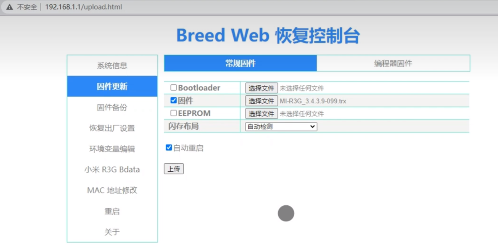

等待固件写入

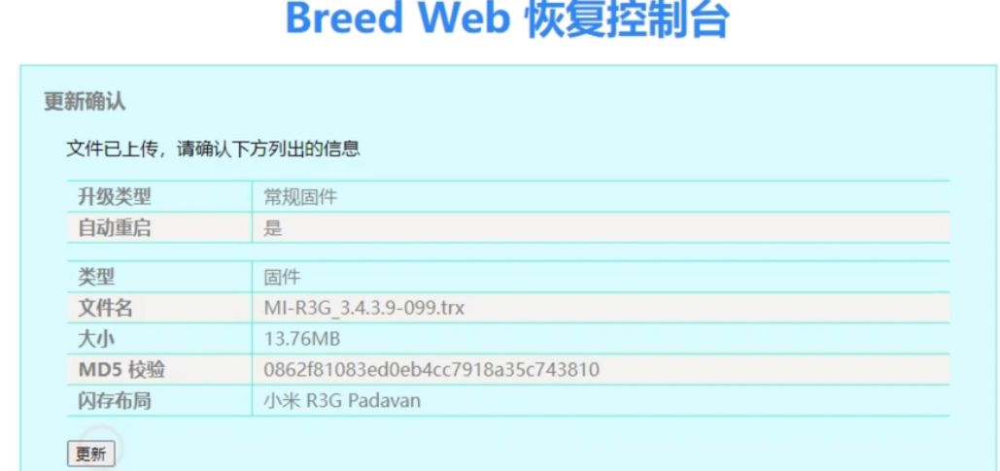

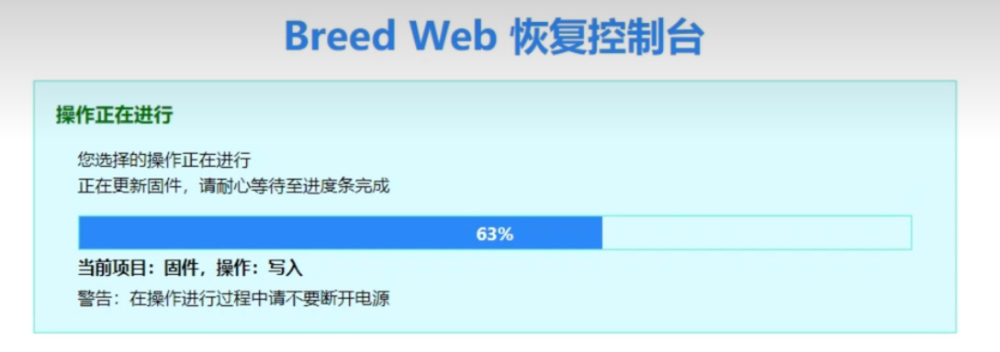

刷好了之后，路由器会自动重启，此时你应该能看到两个新的WIFI

~~~
PDCN
PDCN_5G
~~~

说明新固件已经写入完成了！

这里的WiFi是带密码的，[hiboy固件的基本信息](https://iqqoz.com/post-3195.html)如下

~~~
路由器管理页面：192.168.123.1或http://my.router/
默认管理账户：admin
默认管理密码：admin
WIFI密码：1234567890
~~~

你还可以通过`我的电脑-网络`里面的小米路由器图标进入管理页面

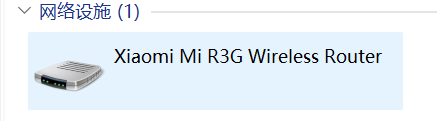

如果能正常进入管理页面，就OJBK了

此时可以断开路由器和电脑的网线，将路由器接入校园网

-----

## 7.配置wifi

进入管理页面后，请修改管理员密码

> 管理员密码和WiFi密码并**不同步**，可以设置成和wifi密码一样，也可以不同

这里建议把`2.4/5G`的WiFi设置成不同的名字方便区分，密码可以弄一样的

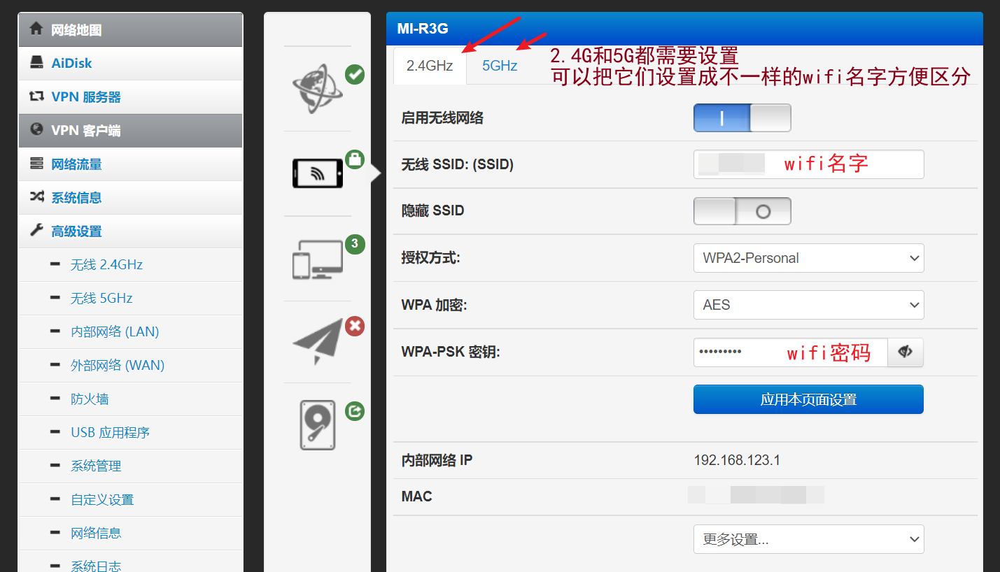

`hiboy`固件似乎不支持`2.4G/5G`频段的合并（即以一个wifi显示）

不过问题不大，只要你的设备能搜得到这个5Ghz的WiFi，那就使用5Ghz的就可以了！

* 5Ghz速度更快，但是透墙性差
* 2.4Ghz范围更广，但是速度没有5Ghz那么快

连接wifi后，先手动登陆一下校园网，测试路由器是否能正常联网

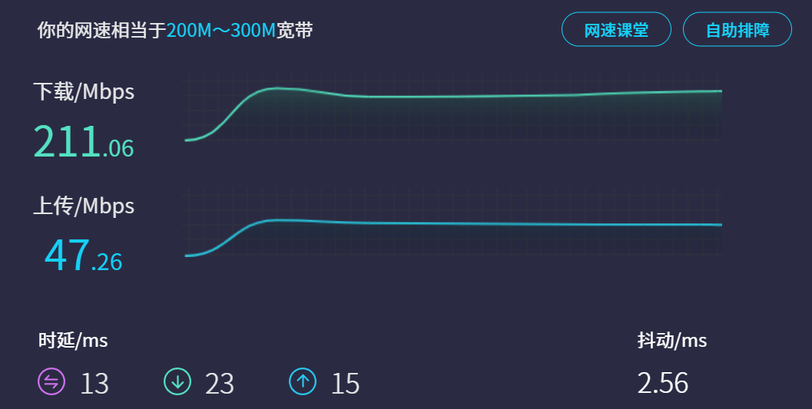

----

## 8.使用脚本登录

现在就要请出大佬写的脚本了！

同样是使用Xshell连接路由器，这时候可以创建一个新的会话，方便日后打开

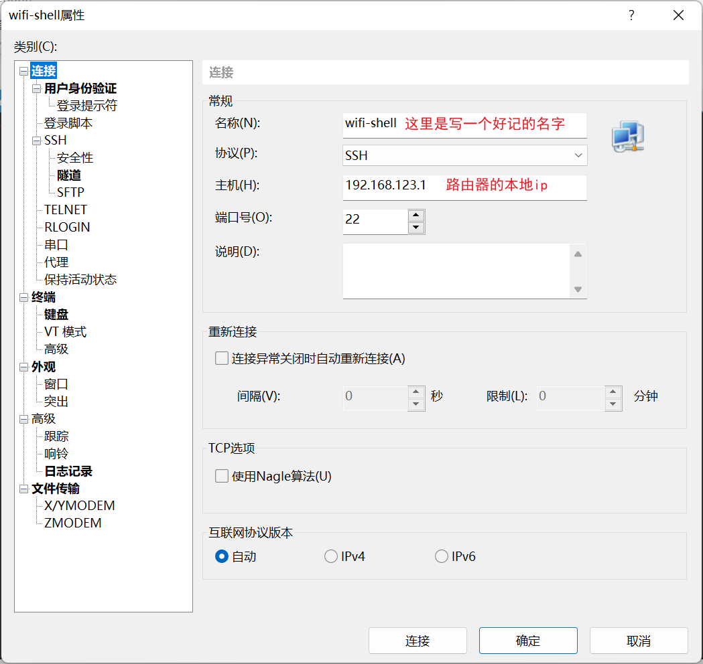

点击左上角的文件夹图标，打开刚刚创建的会话

输入用户名`admin`，密码为刚刚你设置的**管理员密码**

连接成功后的页面应该是下面这样子的

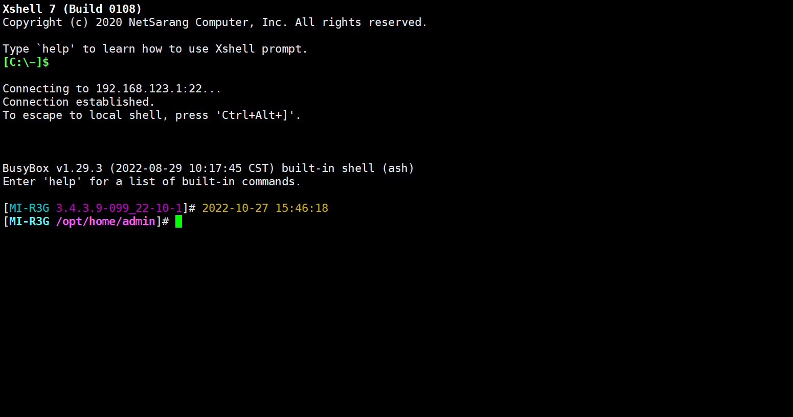

点击上面的绿色图标打开Xftp

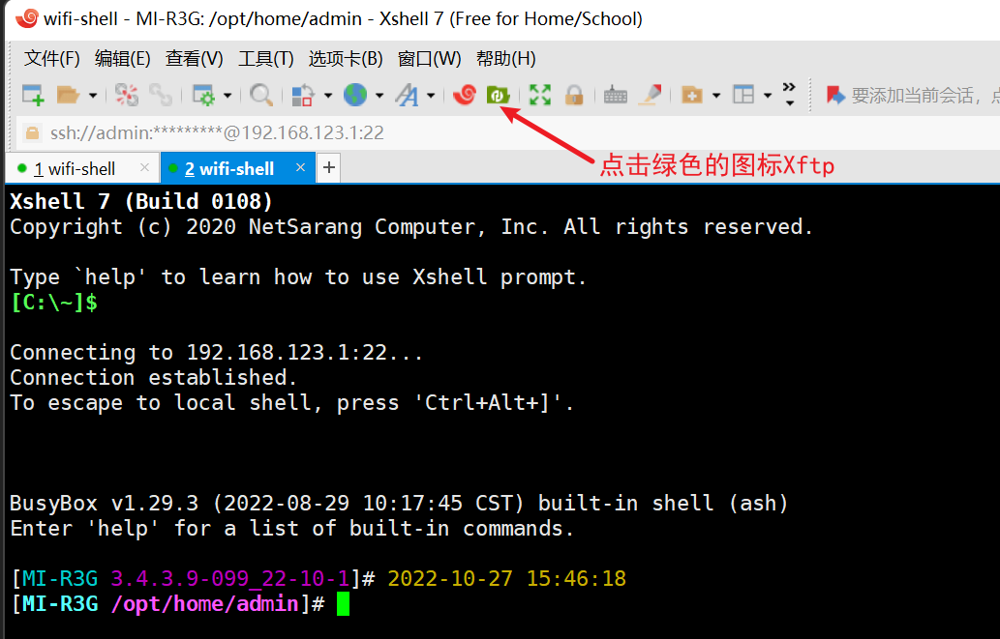

他会弹出下面的页面，左边是你电脑上的文件，右边是路由器路径下的文件

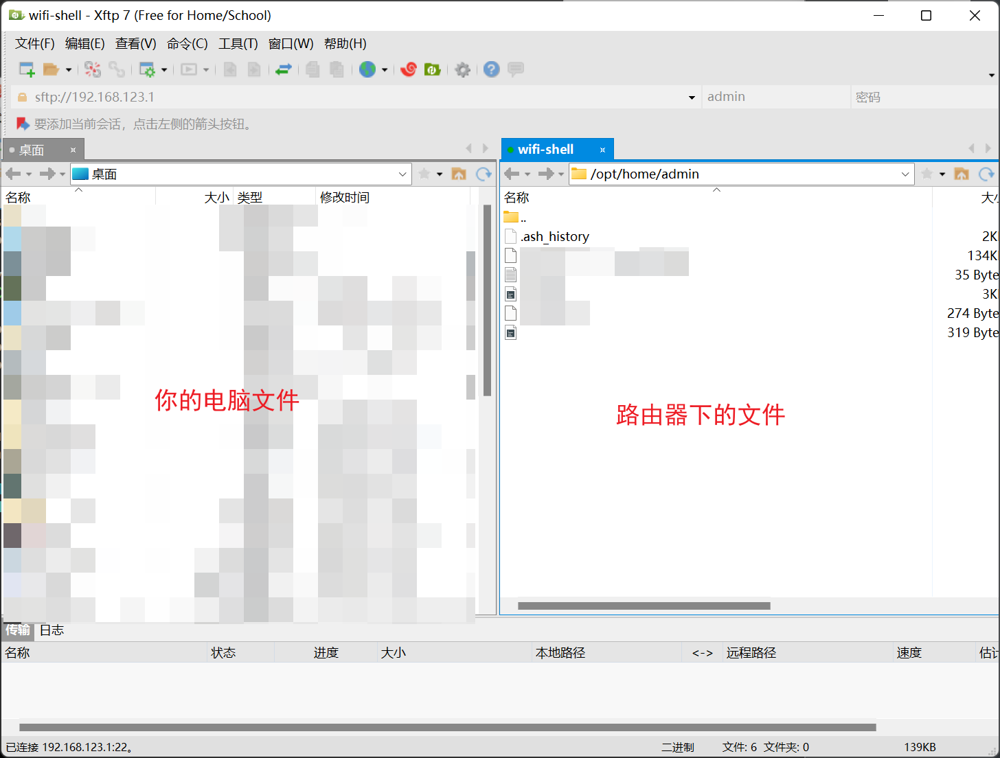

直接下载本仓库下的 [/data/njuptLogin.sh](./njuptLogin.sh) 文件，传入路由器

或者复制里面的内容，用Xftp在路由器路径下创建一个新的`njupt.sh`文件，将内容复制进去

>这里`.sh`文件名是可以自定义的，后续命令对应更改即可

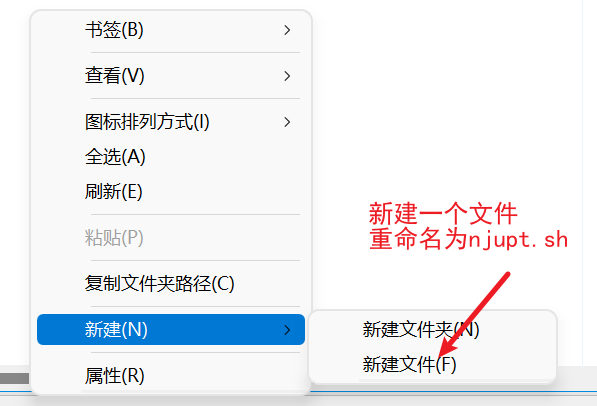

----

在路由器下执行`ifconfig`，找到以`eth`为开头，里面有`inet addr:你的路由器ip`哪一项，记住它的编号。

如下图，我的路由器网线端口编号为`eth3`

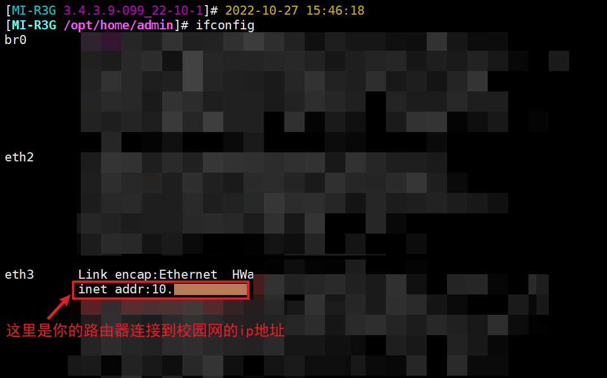

在Xftp内，右键你刚刚创建的`.sh`文件，选择`用记事本编辑`

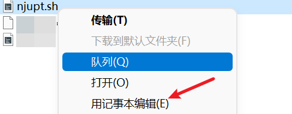

将该脚本中对应的`eth`编号改为上面用`ifconfig`查到的那个

我这里就改成了`eth3`

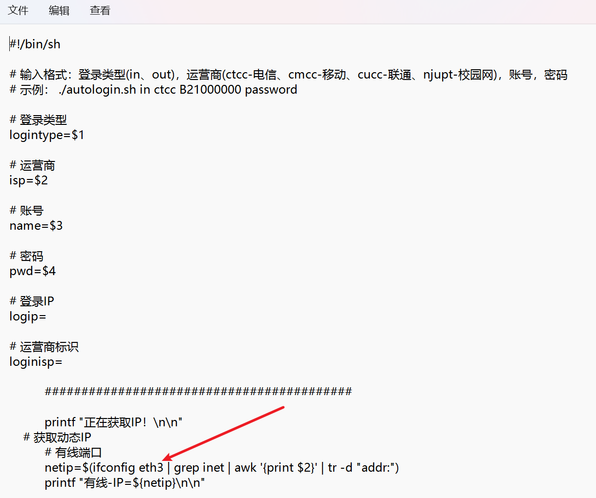

保存后退出，在Xshell中执行下面的命令，将`njupt.sh`的权限修改为`777`

~~~bash
chmod 777 njupt.sh
~~~

这里是linux权限相关的操作，感兴趣的可以自己去学习一下Linux的相关知识

修改完成后，`ls`确认权限如下

~~~bash
-rwxrwxrwx    1 admin    amdin          2832 Oct 24 21:53 njupt.sh
~~~

执行下面的命令

~~~bash
./njupt.sh in 登录平台 账户 密码
~~~

其中平台对应为

~~~
ctcc  电信
cmcc  移动
njupt 校园网
~~~

如我用的是电信的网络，则执行下面的命令

~~~bash
./njupt.sh in ctcc 账户 密码
~~~

当出现下面的打印提示的时候，就登录成功了！

~~~
执行登录操作！

当前是电信网！
~~~

测试成功后，将该文件移动道`/etc/storage/`路径下（否则系统重启后文件可能丢失）

~~~bash
cp njupt.sh /etc/storage/njupt.sh
~~~

移动完毕后，再次执行脚本查看是否能正常使用

~~~bash
/etc/storage/./njupt.sh in 登录平台 账户 密码
~~~

如果可以，则进入系统管理后台，找到下图所示位置，点击底部的上传按钮，保存文件

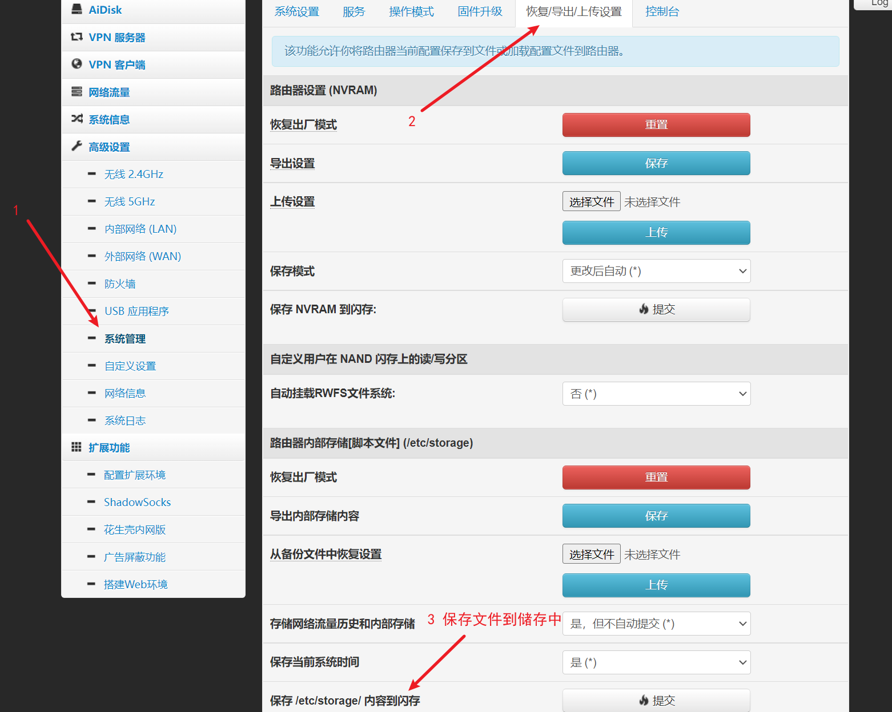

----

## 9.Crontab自动登录

上面是我们手动执行了命令进行登录，我们还需要设置早上7点的自动登录操作

进入路由器的`管理后台-系统管理-服务-计划任务(crontab)`，在里面输入下面的命令进行配置

~~~
10 7 * * * /etc/storage/./njupt.sh in ctcc 账户 密码
~~~

这个命令的意思是，在每天早上**7点10**的时候，自动登录校园网

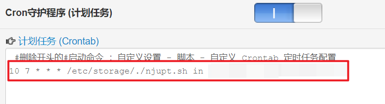

这里配置完毕之后，**点击保存**，就一切就绪了

明天上午来看看你的路由器有没有自动登录成功吧！

## 10.开机自启脚本

除了早上的定时任务以外，有的时候我们可能需要断电移动路由器，或者学校断电了。这时候还可以定制一个开机自启的任务，用来在路由器启动后登录校园网

在`高级设置-自定义设置-脚本`中，可以找到`在路由器启动后执行`

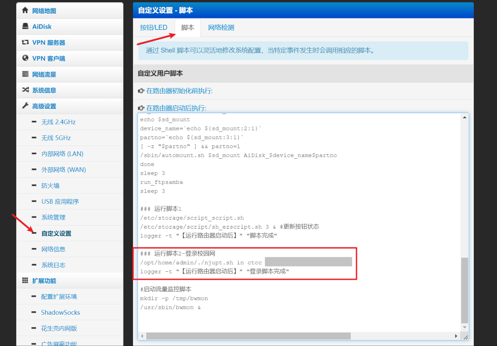

如上图，在这里添加以下字段（#后的是注释）

~~~shell
### 运行脚本2-登录校园网
/etc/storage/./njupt.sh in 登陆平台 账户 密码 
logger -t "【运行路由器启动后】" "登录脚本完成"
~~~

断电重启，看看我们的配置是否成功

测试一下是否有网，一切就绪！

-----

# 进阶操作

小米3G路由器上有个USB接口，除了用来刷机以外，还能用来当一个**本地的磁盘**使用！

你可以在这上面插一个大容量U盘，在U盘里面下载电影。这样就能直接在电脑、手机上访问播放，无需将下载好的电影用数据线从电脑传到手机上了

> 如果你知道如何配置frp，还可以将它变成一个你自己的网盘

也可以通过u盘快速的在手机-电脑之间互传数据

## 开启smb

在`高级设置-usb应用程序`中，开启SMB服务器

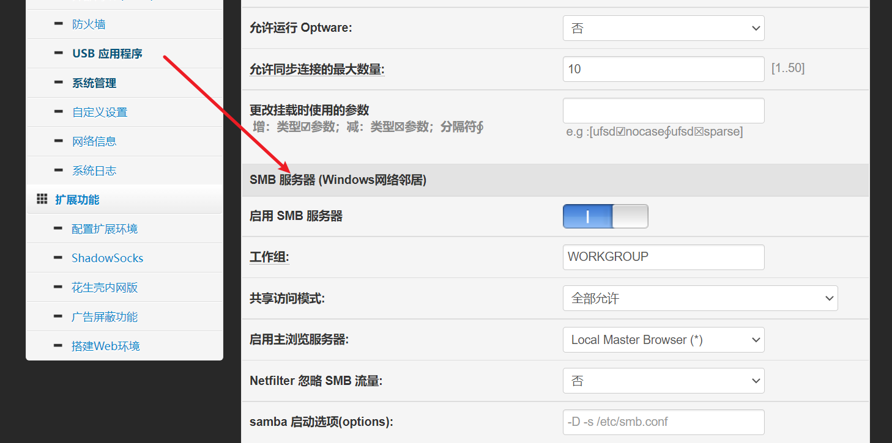

此时在**我的电脑-网络**里面，就可以看到插在路由器上面的u盘了

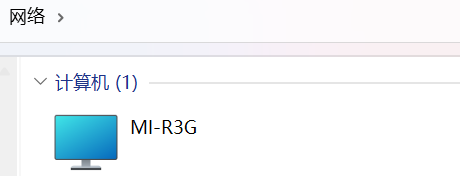

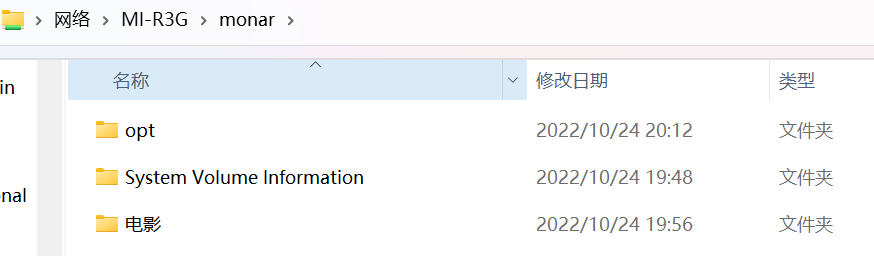

手机访问可以下载`播放器Oplayer`，在左侧列表的`网络-本地网络`中，也可以看到这个U盘，访问里面的文件进行播放

## 开启DLNA

如果你宿舍还有个**投影仪/电视**（真的有人带电视来学校吗？？）也可以开启DLNA，让这些智能设备也可以访问到这个U盘里面的内容

如下图，在`高级设置-usb应用程序-DLNA`中打开，只需要设置根目录为`BrowseFloders`即可

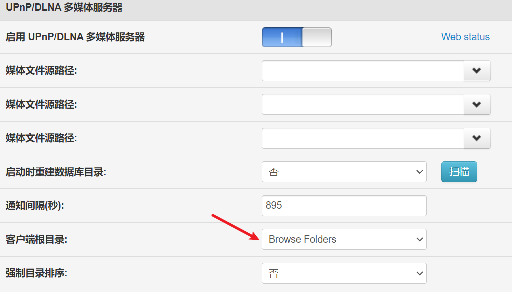

